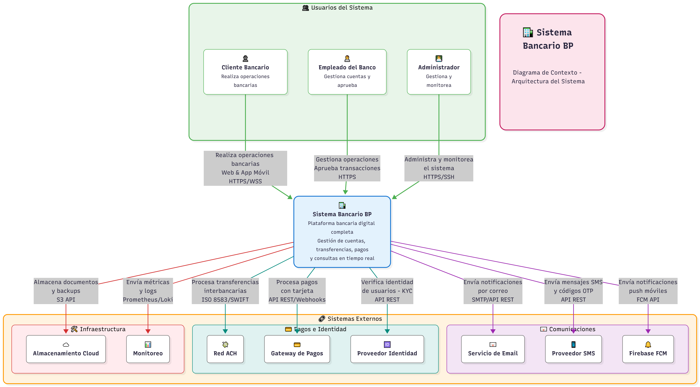
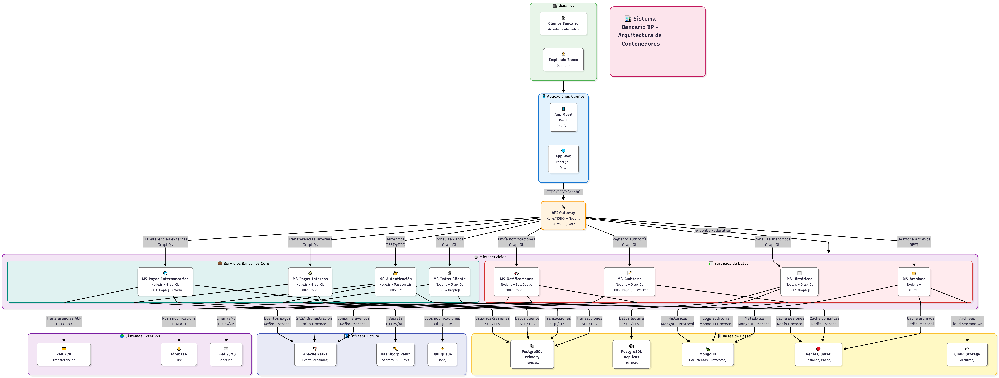
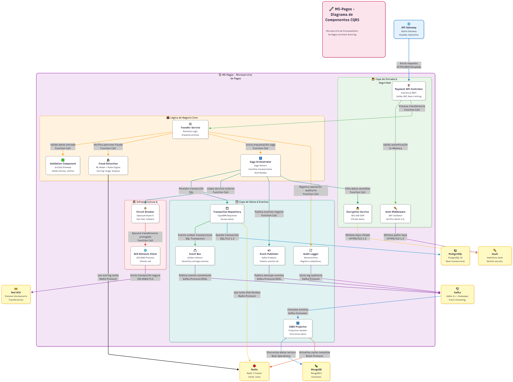

# 🏦 Propuesta de Arquitectura - Sistema Bancario BP

[](https://test.keywordcv.com/index.html)
[](https://test.keywordcv.com/index.html)
[]()

## 📋 Descripción

Propuesta técnica completa de arquitectura de software para un sistema bancario moderno, desarrollada como parte del proyecto Sistema Bancario BP. Este documento presenta una arquitectura robusta, escalable y segura basada en microservicios, diseñada específicamente para el sector financiero.

## 🌟 Características Principales

- **📱 Diseño Responsive**: Compatible con desktop, tablet y móviles
- **🎨 Diagramas Interactivos**: Diagramas Mermaid interactivos con zoom, pan y touch en dispositivos móviles
- **🔄 Navegación Intuitiva**: Sistema de navegación entre capítulos y acceso rápido desde el índice
- **📊 Visualización Clara**: Tablas comparativas, diagramas de flujo, y arquitecturas visuales
- **🎯 Enfoque Práctico**: Justificaciones técnicas, estimaciones de costos y casos de uso reales
- **📄 Versión PDF**: Disponible para descarga y lectura offline

## 📥 Descargar PDF

**[⬇️ Descargar Propuesta Completa en PDF](https://test.keywordcv.com/propuesta-arquitectura-bp.pdf)**

> 📄 Documento completo de 17 capítulos con todos los diagramas y tablas para lectura offline

## 📥 Ver en la Web

**[⬇️ Visitar Propuesta Completa en PDF](https://test.keywordcv.com/)**

> 📄 Página web con 17 capítulos con todos los diagramas y tablas para lectura online

---

## Diagramas de Arquitectura (Modelo C4)

> **Modelo C4** - Context, Containers, Components, Code: Enfoque de "zoom" para documentar arquitecturas de software creado por Simon Brown. Más información en [c4model.info](https://c4model.info/)

<div align="center">

### Tres Niveles de Abstracción

| Nivel          | Diagrama     | Audiencia               | Propósito                      |
| -------------- | ------------ | ----------------------- | ------------------------------ |
| **C4 Level 1** | Contexto     | Stakeholders, Gerencia  | Sistema en su entorno completo |
| **C4 Level 2** | Contenedores | Arquitectos, Tech Leads | Aplicaciones y servicios       |
| **C4 Level 3** | Componentes  | Desarrolladores         | Detalle interno y patrones     |

</div>

---

### Diagrama 1: Contexto del Sistema (C4 Level 1)

<div align="center">



</div>

**Para:** Stakeholders no técnicos, gerencia, usuarios de negocio

**Muestra:**

- El Sistema Bancario BP en su entorno completo
- Usuarios del sistema (clientes, empleados, administradores)
- Sistemas externos con los que interactúa (ACH Network, servicios de email/SMS, Firebase, etc.)
- Flujos de información principales entre el sistema y su entorno

**Nivel de detalle:** Alto nivel, sin detalles técnicos de implementación

---

### Diagrama 2: Contenedores del Sistema (C4 Level 2)

<div align="center">



</div>

**Para:** Arquitectos de software, líderes técnicos, DevOps

**Muestra:**

- **Aplicaciones Frontend:** Web App (React.js) y Mobile App (React Native)
- **API Gateway:** Kong/NGINX como punto de entrada único
- **Microservicios:** MS-Autenticación, MS-Cuentas, MS-Pagos, MS-Históricos, MS-Notificaciones, MS-Auditoría
- **Bases de Datos:** PostgreSQL (primary + replicas), MongoDB, Redis Cluster
- **Mensajería:** Apache Kafka + Zookeeper
- **Seguridad:** HashiCorp Vault para gestión de secretos
- **Tecnologías y protocolos** de comunicación entre componentes

**Nivel de detalle:** Arquitectura técnica de alto nivel con tecnologías específicas

**Stack Tecnológico:**

- **Frontend:** React Native, React.js, TypeScript, Redux Toolkit
- **Backend:** Node.js, Express.js, GraphQL, REST APIs
- **Databases:** PostgreSQL 15, MongoDB 6, Redis 7
- **Messaging:** Apache Kafka, Zookeeper
- **Security:** OAuth 2.0, JWT, HashiCorp Vault
- **Gateway:** Kong Gateway, NGINX

---

### Diagrama 3: Componentes - Microservicio de Pagos (C4 Level 3)

<div align="center">



</div>

**Para:** Desarrolladores, arquitectos que implementarán el sistema

**Muestra:**

- **Componentes internos** del MS-Pagos (ejemplo representativo)
- **Controllers y APIs:** Payment API Controller, Auth Middleware
- **Servicios de negocio:** Transfer Service, Fraud Detection
- **Patrones implementados:** Circuit Breaker, Saga Orchestrator
- **Repositorios:** Transaction Repository con acceso a datos
- **Integraciones:** ACH Client, Event Publisher (Kafka)
- **Seguridad:** Encryption Service, Audit Logger
- **Protocolos específicos** y flujos de datos internos

**Nivel de detalle:** Componentes internos, clases principales, patrones arquitectónicos

**Patrones Arquitectónicos:**

- **Circuit Breaker** - Protección contra fallos en cascada
- **Saga Pattern** - Transacciones distribuidas con compensaciones
- **Event Sourcing** - Publicación de eventos para auditoría
- **Repository Pattern** - Abstracción del acceso a datos
- **Middleware Pattern** - Autenticación y validación reutilizable

**Seguridad Implementada:**

- OAuth 2.0 + JWT para autenticación/autorización
- TLS 1.3 en todas las comunicaciones
- AES-256-GCM para cifrado de datos sensibles
- SASL para autenticación en Kafka
- Secret rotation automática desde Vault
- Rate limiting y input validation
- Audit logging completo para compliance

---

## 📚 Índice de Capítulos

### [🏠 Inicio](https://test.keywordcv.com/index.html)

Página principal con índice general de todos los capítulos de la propuesta.

---

### [Capítulo 1: Introducción y Contexto del Proyecto](https://test.keywordcv.com/capitulo_01.html)

Presentación del proyecto Sistema Bancario BP, objetivos principales, alcance del sistema y contexto de negocio. Se detallan los requisitos funcionales y no funcionales que guiarán todas las decisiones arquitectónicas.

### [Capítulo 2: Análisis de Requisitos Funcionales y No Funcionales](https://test.keywordcv.com/capitulo_02.html)

Desglose exhaustivo de los requisitos del sistema, incluyendo casos de uso, historias de usuario, y especificaciones técnicas. Se priorizan requisitos críticos para el sector bancario como seguridad, disponibilidad y compliance.

### [Capítulo 3: Arquitectura de Alto Nivel](https://test.keywordcv.com/capitulo_03.html)

Visión general de la arquitectura propuesta con diagramas de contexto, contenedores y componentes principales. Presenta la estructura de microservicios y las decisiones arquitectónicas fundamentales.

### [Capítulo 4: Patrones de Arquitectura Aplicados](https://test.keywordcv.com/capitulo_04.html)

Análisis detallado de los patrones arquitectónicos seleccionados: Microservicios, Event-Driven Architecture, CQRS, API Gateway, Circuit Breaker, y otros patrones esenciales para sistemas distribuidos resilientes.

### [Capítulo 5: Diseño de Microservicios](https://test.keywordcv.com/capitulo_05.html)

Descomposición del sistema en microservicios independientes. Incluye responsabilidades de cada servicio, APIs expuestas, dependencias, y estrategias de comunicación síncrona y asíncrona.

### [Capítulo 6: Arquitectura de Datos y Bases de Datos](https://test.keywordcv.com/capitulo_06.html)

Diseño de la capa de persistencia con PostgreSQL como base de datos principal. Incluye modelado de datos, estrategias de particionamiento, índices, replicación y backup. Se justifica la elección de tecnologías de almacenamiento.

### [Capítulo 7: API Gateway y Gestión de APIs](https://test.keywordcv.com/capitulo_07.html)

Implementación de API Gateway como punto de entrada único. Cubre autenticación OAuth 2.0, rate limiting, transformación de requests/responses, agregación de servicios y estrategias de versionado de APIs.

### [Capítulo 8: Arquitectura Frontend Multiplataforma](https://test.keywordcv.com/capitulo_08.html)

Análisis comparativo de frameworks multiplataforma (React Native, Flutter, Kotlin Multiplatform) con justificación técnica de la elección. Incluye arquitectura del frontend, gestión de estado, testing, y estrategia CI/CD para aplicaciones móviles.

**Highlights:**

- ✅ Comparación técnica de 3 frameworks con matriz FODA
- 💰 Análisis de costos totales a 3 años
- 📱 Stack tecnológico completo para web y móvil
- 🔐 Seguridad en frontend y prevención de ataques

### [Capítulo 9: Infraestructura Cloud y Orquestación con Kubernetes](https://test.keywordcv.com/capitulo_09.html)

Estrategia de despliegue en Kubernetes con configuración multi-ambiente (producción, pre-producción, desarrollo). Incluye autoescalado HPA/VPA, balanceo de carga, health checks, observabilidad con ELK Stack y Prometheus, y gestión de secretos con Vault.

**Highlights:**

- ☁️ Arquitectura completa en Kubernetes con 3 ambientes
- 🔄 Autoescalado automático (HPA + VPA)
- 📊 Observabilidad con ELK + Prometheus + Grafana
- 🔐 Secrets management con HashiCorp Vault
- 💰 Estimación de costos cloud optimizados

### [Capítulo 10: Seguridad y Cumplimiento Normativo](https://test.keywordcv.com/capitulo_10.html)

Framework de seguridad integral cubriendo autenticación, autorización, encriptación, prevención de amenazas y cumplimiento de regulaciones bancarias (PCI-DSS, GDPR). Incluye estrategias de defense-in-depth y respuesta a incidentes.

### [Capítulo 11: Alta Disponibilidad y Resiliencia del Sistema](https://test.keywordcv.com/capitulo_11.html)

Estrategias para garantizar 99.9% de uptime. Incluye réplicas de microservicios y bases de datos, Circuit Breaker pattern, retry con exponential backoff, graceful degradation, disaster recovery, y los tres pilares de resiliencia: resistencia, adaptación y recuperación.

**Highlights:**

- 🎯 SLA de 99.9% uptime (8.76 horas downtime/año)
- 🔄 Failover automático de PostgreSQL en <20 segundos
- 🛡️ Circuit Breaker y Bulkhead patterns
- 📈 Adaptación dinámica con queue-based load leveling
- 🔧 Self-healing automático en Kubernetes
- 🧪 Chaos Engineering para validar resiliencia

### [Capítulo 12: Monitoreo, Logging y Observabilidad](https://test.keywordcv.com/capitulo_12.html)

Implementación de stack de observabilidad completo con métricas (Prometheus + Grafana), logs centralizados (ELK Stack), trazas distribuidas (Jaeger), y sistema de alertas proactivo. Incluye dashboards operacionales y de negocio.

### [Capítulo 13: Testing y Calidad del Software](https://test.keywordcv.com/capitulo_13.html)

Estrategia de testing integral cubriendo pirámide de tests: unitarios, integración, E2E, performance, security, y chaos testing. Incluye cobertura de código objetivo, herramientas recomendadas y proceso de QA continuo.

### [Capítulo 14: CI/CD y DevOps](https://test.keywordcv.com/capitulo_14.html)

Pipeline de CI/CD automatizado desde código hasta producción. Incluye estrategias de deployment (blue-green, canary), gestión de configuraciones, GitOps, y prácticas DevOps para acelerar el time-to-market manteniendo calidad.

### [Capítulo 15: Escalabilidad y Performance](https://test.keywordcv.com/capitulo_15.html)

Estrategias de escalabilidad horizontal y vertical. Análisis de cuellos de botella, técnicas de optimización, caching strategies, CDN, y load testing. Incluye proyecciones de crecimiento y capacidad planning.

### [Capítulo 16: Estimación de Costos y ROI](https://test.keywordcv.com/capitulo_16.html)

Análisis financiero completo con costos de infraestructura cloud, licencias, desarrollo, operación y mantenimiento. Incluye comparativas de costos, optimizaciones recomendadas y cálculo de ROI del proyecto.

### [Capítulo 17: Roadmap de Implementación](https://test.keywordcv.com/capitulo_17.html)

**🚧 Próximamente:** Diagramas C4 de arquitectura

---

## 🎨 Diagramas Interactivos

Esta propuesta utiliza **Mermaid.js** para diagramas técnicos interactivos:

### Características de los Diagramas:

- **🖱️ Zoom y Pan**: Haz clic y arrastra para navegar por diagramas complejos
- **📱 Touch Friendly**: Soporte completo para gestos táctiles en móviles y tablets
- **🎨 Colores Pastel**: Esquema de colores suave para mejor legibilidad
- **🔄 Tipos Variados**: Flowcharts, diagramas de estado, grafos, mindmaps, y más
- **📐 Responsive**: Se adaptan automáticamente al tamaño de la pantalla

### Tipos de Diagramas Incluidos:

- **Flowcharts** - Flujos de procesos y arquitecturas
- **State Diagrams** - Estados del sistema (ej: Circuit Breaker)
- **Sequence Diagrams** - Interacciones entre componentes
- **Graph/Mindmap** - Estructuras jerárquicas y organizacionales
- **Class Diagrams** - Modelos de datos y relaciones

## 🛠️ Tecnologías Utilizadas

- **HTML5** - Estructura semántica
- **CSS3** - Estilos y diseño responsive
- **Mermaid.js 10.6.1** - Diagramas interactivos
- **JavaScript** - Interactividad y navegación

## 🚀 Cómo Visualizar

### Online

Visita directamente: **[test.keywordcv.com](https://test.keywordcv.com/index.html)**

### Local

```bash
# Clonar el repositorio
git clone [URL_DEL_REPOSITORIO]

# Abrir en navegador
# Opción 1: Doble clic en index.html
# Opción 2: Usar servidor local
python -m http.server 8000
# Luego abrir: http://localhost:8000
```

## 📁 Estructura del Proyecto

```
propuesta-arquitectura-bp/
├── index.html              # Página principal con índice
├── capitulo_01.html        # Introducción y Contexto
├── capitulo_02.html        # Análisis de Requisitos
├── capitulo_03.html        # Arquitectura de Alto Nivel
├── capitulo_04.html        # Patrones de Arquitectura
├── capitulo_05.html        # Diseño de Microservicios
├── capitulo_06.html        # Arquitectura de Datos
├── capitulo_07.html        # API Gateway
├── capitulo_08.html        # Frontend Multiplataforma
├── capitulo_09.html        # Infraestructura Kubernetes
├── capitulo_10.html        # Seguridad y Compliance
├── capitulo_11.html        # Alta Disponibilidad
├── capitulo_12.html        # Monitoreo y Observabilidad
├── capitulo_13.html        # Testing y Calidad
├── capitulo_14.html        # CI/CD y DevOps
├── capitulo_15.html        # Escalabilidad
├── capitulo_16.html        # Estimación de Costos
├── capitulo_17.html        # Roadmap de Implementación
├── styles.css              # Estilos globales
├── propuesta-arquitectura-bp.pdf  # Versión PDF
└── README.md               # Este archivo
```

## 📊 Highlights de la Propuesta

| Aspecto            | Solución Propuesta                           |
| ------------------ | -------------------------------------------- |
| **Arquitectura**   | Microservicios con Event-Driven Architecture |
| **Frontend**       | React Native (Web + iOS + Android)           |
| **Backend**        | Node.js + GraphQL + REST APIs                |
| **Base de Datos**  | PostgreSQL (primary) + MongoDB + Redis       |
| **Mensajería**     | Apache Kafka + ZooKeeper                     |
| **Orquestación**   | Kubernetes (EKS/AKS/GKE)                     |
| **Observabilidad** | ELK Stack + Prometheus + Grafana             |
| **CI/CD**          | GitLab CI / GitHub Actions                   |
| **Seguridad**      | OAuth 2.0 + JWT + HashiCorp Vault            |
| **Disponibilidad** | 99.9% uptime (SLA)                           |
| **Escalabilidad**  | Autoescalado HPA/VPA                         |

## 🎯 Decisiones Arquitectónicas Clave

1. **Microservicios**: Máxima independencia y escalabilidad por servicio
2. **React Native**: Stack unificado JavaScript, 60-70% código compartido, ahorro $430K en 3 años vs Kotlin MP
3. **PostgreSQL**: ACID compliance, madurez, rendimiento probado en fintech
4. **Kubernetes**: Orquestación cloud-agnostic, autoescalado, self-healing
5. **GraphQL**: Eficiencia en apps móviles, single endpoint, typed schema
6. **Kafka**: Throughput 1M+ msgs/seg, durabilidad, replay capability
7. **ELK + Prometheus**: Observabilidad completa (logs + métricas + traces)

## 🔒 Seguridad y Compliance

- ✅ OAuth 2.0 + JWT para autenticación
- ✅ Encriptación en reposo y tránsito
- ✅ Certificate pinning en apps móviles
- ✅ Rate limiting y DDoS protection
- ✅ Vault para gestión de secretos
- ✅ Auditoría completa de transacciones
- ✅ PITR (Point-in-Time Recovery)
- ✅ Backups automáticos con retención regulada

## 📈 Métricas de Éxito

| Métrica                | Objetivo |
| ---------------------- | -------- |
| **Uptime**             | 99.9%    |
| **Latencia API (p95)** | < 200ms  |
| **Error Rate**         | < 0.1%   |
| **RTO**                | < 15 min |
| **RPO**                | < 5 min  |
| **MTTR**               | < 15 min |
| **Cobertura Tests**    | > 80%    |

## 📞 Contacto y Soporte

Para consultas sobre esta propuesta:

- 📧 Email: lesniergonzalez@gmail.com
- 🌐 Web: [Lesnier González López (Portal de Portafolio y Colaboraciones empresariales)](https://lesinnovations.tech)
- 📱 LinkedIn: [Ver experiencia y Certificados](https://www.linkedin.com/in/lesnier-gonzalez/)

## 📝 Notas de Versión

### Versión 1.0 (Actual)

- ✅ 17 capítulos completos
- ✅ Diagramas Mermaid interactivos
- ✅ Diseño responsive
- ✅ Versión PDF disponible
- ✅ Estimaciones de costos detalladas
- ✅ Casos de uso del sector bancario

---

<div align="center">

**🏦 Sistema Bancario BP - Arquitectura de Software**

_Desarrollado con_ ❤️ _para el sector financiero_

[🏠 Inicio](https://test.keywordcv.com/index.html) • [📄 PDF](https://test.keywordcv.com/propuesta-arquitectura-bp.pdf) • [📧 Contacto](#contacto-y-soporte)

</div>
